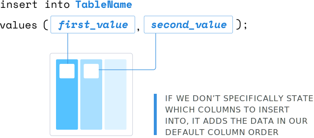
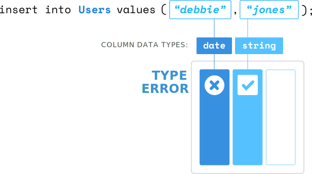

<!-- ADD DATA -->

<link href="style.css" rel="stylesheet"></link>

As you can imagine, when a table is created, it contains no data from the start. The first step in making your database useful is by adding data. We'll do this by using the `insert` command.

We'll say, `insert into Users (create_date, user_handle, last_name, first_name) values ('2018-06-06', 'a0eebc99-9c0b-4ef8-bb6d-6bb9bd380a11', 'clark', 'tyler');`. `Users` is the name of the table we're inserting data into. This first set of parentheses shows the columns that the data will match up with.

```sql
$ postgres=# insert into Users (create_date, user_handle, last_name, first_name) values ('2018-06-06', 'a0eebc99-9c0b-4ef8-bb6d-6bb9bd380a11', 'clark', 'tyler');
INSERT 0 1
$ postgres #
```


One thing to take notice of is the order in which we define the columns. The data listed below in the second set of parentheses will insert according to the order these columns are defined in.

When inserting data, there are two required components to work. First is the table the data is going into. Second is the actual data. We don't actually need to define the order of columns here.

```sql
$ postgres=# insert into Users values ('2018-06-06', 'a0eebc99-9c0b-4ef8-bb6d-6bb9bd380a11', 'jones', 'debbie');
INSERT 0 1
$ postgres #
```


As we can see here, we did not provide the corresponding column names or data it needs to match up with. This will insert into the table in the order the columns within the table were created by. It is generally accepted that listing your columns out is best practice because it's more explicit.

Keep in mind that our desired inserted data needs to match up with the defined column types. For example, if we insert into our table with only two values, we're going to get a type issue because `create_date` is a `type date`, and we're giving it a string of `jones`.

```sql
$ postgres=# insert into Users values ('jones', 'debbie');
ERROR invalid input syntax for type date: "jones"
LINE 1: insert into Users values ('jones', 'debbie');
$ postgres #
```



If we were to fix this problem, changing `jones` to a `date`, we'd still get an error because now `debbie`, the string, does not match up with a `uuid` type.

```sql
$ postgres=# insert into Users values ('2018-06-06', 'debbie');
ERROR invalid input syntax for uuid: "debbie"
LINE 1: insert into Users values ('2018-06-06', 'debbie');
$ postgres #
```

We also don't need to provide predefined values. Most SQL databases have built-in functions that can generate values for us. Here, we're inserting a new row into users with just the created column. We're using a built-in function in Postgres called `now`. 

```sql
$ postgres=# insert into Users (create_date) values (now());
INSERT 0 1
$ postgres #
```


The `now` function returns a date type of today's date. Finally, we have the ability to insert more than one row of data at a time. All we need to do is comma separate new sets of data. Here, we're inserting three new rows of data into our users table. 

```sql
$ postgres=# insert into Users (create_date) values (now()), (now()), (now());
INSERT 0 3
$ postgres #
```


Because we're only specifying `create_date` and passing the now to each set of data, it will provide null values for `user_handle`, `first_name`, and `last_name`.

Of course, if we wanted to add more data to each row, we'd just need to define the columns here in `(create_data)`, and then provide the data here in `(now())`.

You might be wondering if there's a way to bulk insert data into a table -- for example, from a csv. The answer is yes. However, it's a little too advanced for this course. I recommend looking into that if you're curious. For Postgres, it involves the copy command.
