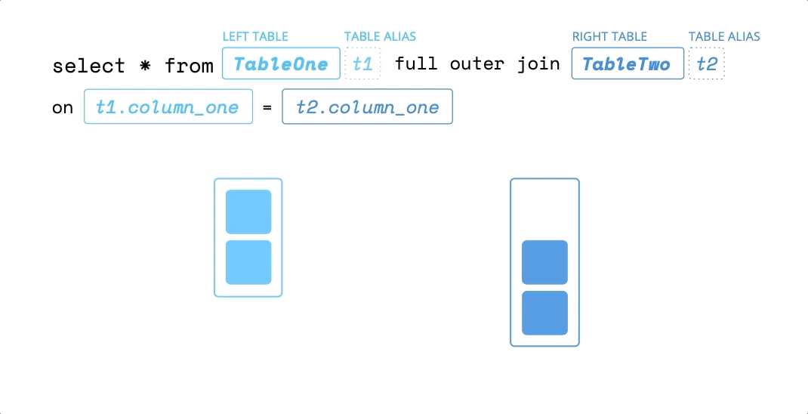

<!-- JOINS -->

<link href="style.css" rel="stylesheet"></link>

If this is the first time getting your hands dirty with SQL and databases, you might find yourself thinking that your tables need to hold as many columns that are relevant as possible. For example, when dealing with `Users`, as in our case, we could add more columns for email, address, phone number for each person, and then gone even deeper with their user history, like if they've changed their email from what to what, and then a column for when that happened.

```sql 
$ postgres=# select * from Users; 
  create_date |             user_handle              | last_name | first _name 
--------------+--------------------------------------+-----------+-------------
  2018-06-06  | 2839f831-f82c-faj3-aof3-fj28ddks39ek | clark     | tyler  
  2019-02-01  | 6ab3b2d2-8e02-890c-bb6d-61a67cd43f31 | jones     | debbie    
  2010-01-10  | a0eebc99-9c0b-42f8-g3eh-6bb9bd380a11 | freemon   | mary  
  (3 rows)
```

Before long, you'll find that your table has too many columns to keep track of. Eventually, this one table will have to deal with a lot of transactions at the same time, especially, as you scale your application. Instead, we want to keep our tables simple and modular. We have our users table with three users. I've also gone ahead and created a `Purchases` table that has two rows of data.

```sql 
$ postgres=# select * from Purchases; 
         date |             user_handle              |                   sku                    | quality 
--------------+--------------------------------------+------------------------------------------+-------------
  2018-12-12  | 2839f831-f82c-faj3-aof3-fj28ddks39ek | f82jkfhs-al4e-cmn3-f98c-jhub42kvogj5     |       2  
  2019-02-02  | a0eebc99-9c0b-42f8-g3eh-6bb9bd380a11 | 6ab3b2d2-8e02-890c-bb6d-61a67cd43f31     |       1    
  (2 rows)
```

Each one of these rows represents a purchase that someone from our `Users` table made. Let's say that we were making a dashboard within our application that displayed the user's information as well as their purchase history, which is really common. We could make two separate calls to our database to get this info, one, to get all the info about the user and the other, to get all of their purchases. Instead what we can do is get it all out in one query by joining these two tables together. In our first example, we'll use the `left outer join`. 

```sql 
$ postgres=# select * from Users u left outer join Purchases p on u.user_handle = p.user_handle; 
 create_date |             user_handle              | last_name | first _name  |  date      |             user_handle              |                    sku                 |   quantity 
--------------+-------------------------------------+-----------+--------------+------------+--------------------------------------+--------------------------------------+-----------------
  2018-06-06 | 2839f831-f82c-faj3-aof3-fj28ddks39ek | clark     | tyler        | 2018-12-12 | 2839f831-f82c-faj3-aof3-fj28ddks39ek | f82jkfhs-al4e-cmn3-f98c-jhub42kvogj5 |       2
  2019-02-01 | 6ab3b2d2-8e02-890c-bb6d-61a67cd43f31 | freemon   | mary         | 2019-02-02 | a0eebc99-9c0b-42f8-g3eh-6bb9bd380a11 | 6ab3b2d2-8e02-890c-bb6d-61a67cd43f31 |       1  
  2010-01-10 | a0eebc99-9c0b-42f8-g3eh-6bb9bd380a11 | jones     | debbie
  (3 rows)
```

Now let's walk through what's happening here. We still use the `select *` which will pull out all of our columns returned from the rest of our query. We say from our `Users` table, and this `u` is aliasing the `Users` table, kind of like making it a variable that we can reference throughout the rest of this query. We then say `left outer join` with the `Purchases` table aliased as `p`, on the matching `u.user_handle` between the two tables. 

<div>
<h2 style={{ textAlign: 'center', color: '#3891E0', fontWeight: '300' }}>Left Outer Join</h2>

</div>

Now let's get more into the `join`. You'll see that we now have our two tables' columns added together to form one large table. All of the users columns are accounted for, as well as purchases. You can see we have two user handle columns because they're both shared. When joining tables together, we tell it what condition to join on. This is why we need the `on` statement in our query, so our tables know where to fuse. You'll notice that `Debbie` does not have any purchases, so all the columns are holding the NULL value for each of her purchase columns. `left outer join` is saying, "Get the table and all of its rows stated to the left of the join statement," in our case, `Users`, as our starting set of data. With this data, match it up with the following purchases table rows, filling in NULL values for any missing rows, which again is why Debbie's purchase columns has null values, because she doesn't have a row in purchases.

Now let's change our `left outer join` to be a `right outer join`, and we'll see what we get. 

```sql 
$ postgres=# select * from Users u right outer join Purchases p on u.user_handle = p.user_handle; 
 create_date |             user_handle              | last_name | first _name  |  date      |             user_handle              |                    sku               | quality 
--------------+-------------------------------------+-----------+--------------+------------+--------------------------------------+--------------------------------------+-----------------
  2018-06-06 | 2839f831-f82c-faj3-aof3-fj28ddks39ek | clark     | tyler        | 2018-12-12 | 2839f831-f82c-faj3-aof3-fj28ddks39ek | f82jkfhs-al4e-cmn3-f98c-jhub42kvogj5 |       2
  2019-02-01 | 6ab3b2d2-8e02-890c-bb6d-61a67cd43f31 | freemon   | mary         | 2019-02-02 | a0eebc99-9c0b-42f8-g3eh-6bb9bd380a11 | 6ab3b2d2-8e02-890c-bb6d-61a67cd43f31 |       1  
(2 rows)
```

We have to zoom way out to see everything. Now with our `right outer join`, we're not starting with a users dataset first. We take the right table's data. In our case, the two `Purchases` table rows and match up the `Users` rows with them. We start with two rows, and that's what we end up with in the end. As you can see, Debbie doesn't show up in this list, because she's not in the purchases table. 

<div>
<h2 style={{ textAlign: 'center', color: '#3891E0', fontWeight: '300' }}>Right Outer Join</h2>

</div>

Now let's `insert` a row into our purchases table and have it generate a random user handle that does not exist in our users table. 

```sql 
$ postgres=# insert into Purchases values ('2019-02-02', uuid_generate_v4(), uuid_generate_v4(), 1);
INSERT 01 
```

We'll rerun our `join` statement and see that because there's no matching user handle for this newly inserted row that matches our `Users` table, we fill in NULL values for the users table data columns.

```sql 
$ postgres=# select * from Users u right outer join Purchases p on u.user_handle = p.user_handle; 
 create_date |             user_handle              | last_name | first _name  |  date      |             user_handle              |                    sku               | quality 
--------------+-------------------------------------+-----------+--------------+------------+--------------------------------------+--------------------------------------+-----------------
  2018-06-06 | 2839f831-f82c-faj3-aof3-fj28ddks39ek | clark     | tyler        | 2018-12-12 | 2839f831-f82c-faj3-aof3-fj28ddks39ek | f82jkfhs-al4e-cmn3-f98c-jhub42kvogj5 |       2
  2019-02-01 | 6ab3b2d2-8e02-890c-bb6d-61a67cd43f31 | freemon   | mary         | 2019-02-02 | a0eebc99-9c0b-42f8-g3eh-6bb9bd380a11 | 6ab3b2d2-8e02-890c-bb6d-61a67cd43f31 |       1  
             |                                      |           |              | 2019-02-02 | pha93nc4-p2l4-cn9x-fn10-fn2kgph82zx4 | 0oqm38fb-fm18-fh2k-3nvo-23hgk4nehvsl |       1  
(3 rows)
```

What if we want both missing rows of data in our combined ultimate table? We want to see Debbie in here, as well as this `Purchases` row that does not have a matching `User`. We do that by using the `full outer join` statement. 

```sql 
$ postgres=# select * from Users u full outer join Purchases p on u.user_handle = p.user_handle; 
 create_date |             user_handle              | last_name | first _name  |  date      |             user_handle              |                    sku               | quality 
--------------+-------------------------------------+-----------+--------------+------------+--------------------------------------+--------------------------------------+-----------------
  2018-06-06 | 2839f831-f82c-faj3-aof3-fj28ddks39ek | clark     | tyler        | 2018-12-12 | 2839f831-f82c-faj3-aof3-fj28ddks39ek | f82jkfhs-al4e-cmn3-f98c-jhub42kvogj5 |       2
  2019-02-01 | 6ab3b2d2-8e02-890c-bb6d-61a67cd43f31 | freemon   | mary         | 2019-02-02 | a0eebc99-9c0b-42f8-g3eh-6bb9bd380a11 | 6ab3b2d2-8e02-890c-bb6d-61a67cd43f31 |       1  
             |                                      |           |              | 2019-02-02 | pha93nc4-p2l4-cn9x-fn10-fn2kgph82zx4 | 0oqm38fb-fm18-fh2k-3nvo-23hgk4nehvsl |       1  
  2010-01-10 | a0eebc99-9c0b-42f8-g3eh-6bb9bd380a11 | jones     | debbie
  (4 rows)
```

The result is we have four total rows with NULL values inserted for missing columns on both sides.

<div>
<h2 style={{ textAlign: 'center', color: '#3891E0', fontWeight: '300' }}>Full Outer Join</h2>

</div>


There's also `inner join`, which is the opposite of `full outer join`. 

```sql 
$ postgres=# select * from Users u inner join Purchases p on u.user_handle = p.user_handle; 
 create_date |             user_handle              | last_name | first _name  |  date      |             user_handle              |                    sku               | quality 
--------------+-------------------------------------+-----------+--------------+------------+--------------------------------------+--------------------------------------+-----------------
  2018-06-06 | 2839f831-f82c-faj3-aof3-fj28ddks39ek | clark     | tyler        | 2018-12-12 | 2839f831-f82c-faj3-aof3-fj28ddks39ek | f82jkfhs-al4e-cmn3-f98c-jhub42kvogj5 |       2
  2019-02-01 | 6ab3b2d2-8e02-890c-bb6d-61a67cd43f31 | freemon   | mary         | 2019-02-02 | a0eebc99-9c0b-42f8-g3eh-6bb9bd380a11 | 6ab3b2d2-8e02-890c-bb6d-61a67cd43f31 |       1  
  (2 rows)
```

It only returns an ultimate joined table, where there's a matching `user_handle` on both tables.

<div>
<h2 style={{ textAlign: 'center', color: '#3891E0', fontWeight: '300' }}>Inner Join</h2>

</div>


Finally, there's `cross join`, which doesn't take a join on statement, because it takes the first table's rows and assigns it each row of the joining purchases table.

```sql 
$ postgres=# select * from Users u cross join Purchases p; 
 create_date |             user_handle              | last_name | first _name  |  date      |             user_handle              |                    sku               | quality 
--------------+-------------------------------------+-----------+--------------+------------+--------------------------------------+--------------------------------------+-----------------
  2018-06-06 | 2839f831-f82c-faj3-aof3-fj28ddks39ek | clark     | tyler        | 2018-12-12 | 2839f831-f82c-faj3-aof3-fj28ddks39ek | f82jkfhs-al4e-cmn3-f98c-jhub42kvogj5 |       2
  2019-02-01 | a0eebc99-9c0b-42f8-g3eh-6bb9bd380a11 | jones     | debbie       | 2018-12-12 | 2839f831-f82c-faj3-aof3-fj28ddks39ek | f82jkfhs-al4e-cmn3-f98c-jhub42kvogj5 |       2
  2010-01-10 | 6ab3b2d2-8e02-890c-bb6d-61a67cd43f31 | freemon   | mary         | 2018-12-12 | 2839f831-f82c-faj3-aof3-fj28ddks39ek | f82jkfhs-al4e-cmn3-f98c-jhub42kvogj5 |       2
  2018-06-06 | 2839f831-f82c-faj3-aof3-fj28ddks39ek | clark     | tyler        | 2019-02-02 | a0eebc99-9c0b-42f8-g3eh-6bb9bd380a11 | 6ab3b2d2-8e02-890c-bb6d-61a67cd43f31 |       1  
  2019-02-01 | a0eebc99-9c0b-42f8-g3eh-6bb9bd380a11 | jones     | debbie       | 2019-02-02 | a0eebc99-9c0b-42f8-g3eh-6bb9bd380a11 | 6ab3b2d2-8e02-890c-bb6d-61a67cd43f31 |       1
  2010-01-10 | 6ab3b2d2-8e02-890c-bb6d-61a67cd43f31 | freemon   | mary         | 2019-02-02 | a0eebc99-9c0b-42f8-g3eh-6bb9bd380a11 | 6ab3b2d2-8e02-890c-bb6d-61a67cd43f31 |       1
  2018-06-06 | 2839f831-f82c-faj3-aof3-fj28ddks39ek | clark     | tyler        | 2019-02-02 | pha93nc4-p2l4-cn9x-fn10-fn2kgph82zx4 | 0oqm38fb-fm18-fh2k-3nvo-23hgk4nehvsl |       1
  2019-02-01 | a0eebc99-9c0b-42f8-g3eh-6bb9bd380a11 | jones     | debbie       | 2019-02-02 | pha93nc4-p2l4-cn9x-fn10-fn2kgph82zx4 | 0oqm38fb-fm18-fh2k-3nvo-23hgk4nehvsl |       1
  2010-01-10 | 6ab3b2d2-8e02-890c-bb6d-61a67cd43f31 | freemon   | mary         | 2019-02-02 | pha93nc4-p2l4-cn9x-fn10-fn2kgph82zx4 | 0oqm38fb-fm18-fh2k-3nvo-23hgk4nehvsl |       1  
  (9 rows)
```

As you can see, I'm in here three times because the purchases table has three rows of data. My `Users` row is duplicated and matched up with each row in `Purchases`, which is why cross join doesn't accept any on conditions.

There are a couple of final points to know when working with joins. If we specifically ask for a column that is shared between two joining tables, we'll get an error asking us which column from which table to pull out. 

```sql
$ postgres=# select user_handle from Users u inner join Purchases p on u.user_handle = p.user_handle;
ERROR:   column reference "user_handle" is ambiguous 
LINE 1:   select user_handle from Users u inner join Purchases p on u....
```

This is why we need to alias our tables, so that we can specify which table column combination we want to pull out. 

```sql
$ postgres=# select user_handle from Users u inner join Purchases p on u.user_handle = p.user_handle;
----------------------------------
  2839f831-f82c-faj3-aof3-fj28ddks39ek
  f82jkfhs-al4e-cmn3-f98c-jhub42kvogj5
(2 rows)
```

Another tidbit is we only had one join on clause. You can add more conditions by using `and`.
