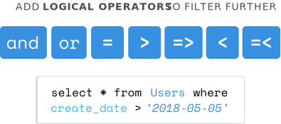

<!-- WHERE -->

<link href="style.css" rel="stylesheet"></link>

When we use the `select` statement as is, we get everything out of our table. 

```sql 
$ postgres=# select * from Users; 
  create_date |             user_handle              | last_name | first _name 
--------------+--------------------------------------+-----------+-------------
  2018-06-06  | 2839f831-f82c-faj3-aof3-fj28ddks39ek | clark     | tyler  
  2018-06-06  | 6ab3b2d2-8e02-890c-bb6d-61a67cd43f31 | jones     | debbie    
(2 rows )
$ postgres=#
```


If we want to filter the results down to specific rows, we use the `where` clause.
Within our `select` statement, let's say select out all the columns where the `where last_name = 'clark';`.

```sql 
$ postgres=# select * from Users where last_name = 'clark'; 
  create_date |             user_handle              | last_name | first _name 
--------------+--------------------------------------+-----------+-------------
  2018-06-06  | 2839f831-f82c-faj3-aof3-fj28ddks39ek | clark     | tyler    
(1 row )
$ postgres=#
```


You can think of the select statement as a for loop. We're looping over each row within the table and pulling it out. This `where` clause is how we can filter down what actually gets returned. Only having one condition within our `where` clause did the job. However, we could get more specific and add more cases. We can add on to our `where` clause an `and first_name = 'tyler'; ` to get the same row back. 

```sql 
$ postgres=# select * from Users where last_name = 'clark' and first_name = 'tyler'; 
  create_date |             user_handle              | last_name | first _name 
--------------+--------------------------------------+-----------+-------------
  2018-06-06  | 2839f831-f82c-faj3-aof3-fj28ddks39ek | clark     | tyler    
(1 row )
$ postgres=#
```

Using the `and` logical operator means that both cases provided here have to be true for any rows to be returned. We could instead use the `or` logical operator as well, which means that at least one of the two cases needs to be true.

```sql 
$ postgres=# select * from Users where last_name = 'clark' or first_name = 'tyler'; 
  create_date |             user_handle              | last_name | first _name 
--------------+--------------------------------------+-----------+-------------
  2018-06-06  | 2839f831-f82c-faj3-aof3-fj28ddks39ek | clark     | tyler    
(1 row )
$ postgres=#
```



When working with dates and numbers, we can use other operators such as the `>`, say, give us the rows `where create_date > '2018-05-05';`, which is going to be both rows. 

```sql 
$ postgres=# select * from Users where create_date > '2018-05-05'; 
  create_date |             user_handle              | last_name | first _name 
--------------+--------------------------------------+-----------+-------------
  2018-06-06  | 2839f831-f82c-faj3-aof3-fj28ddks39ek | clark     | tyler  
  2018-06-06  | 6ab3b2d2-8e02-890c-bb6d-61a67cd43f31 | jones     | debbie  
  
(2 rows )
$ postgres=#
```

We can use the `<`, which will give us neither of the two rows. 

```sql 
$ postgres=# select * from Users where create_date < '2018-05-05'; 
  create_date |             user_handle              | last_name | first _name 
--------------+--------------------------------------+-----------+-------------
(0 rows )
$ postgres=#
```

As well as `=`, which again will give us neither.

```sql 
$ postgres=# select * from Users where create_date < '2018-05-05'; 
  create_date |             user_handle              | last_name | first _name 
--------------+--------------------------------------+-----------+-------------
(0 rows )
$ postgres=#
```

There is `>=`, which will give us back our two rows, because they're greater than May 5th. 

```sql 
$ postgres=# select * from Users where create_date >= '2018-05-05'; 
  create_date |             user_handle              | last_name | first _name 
--------------+--------------------------------------+-----------+-------------
  2018-06-06  | 2839f831-f82c-faj3-aof3-fj28ddks39ek | clark     | tyler  
  2018-06-06  | 6ab3b2d2-8e02-890c-bb6d-61a67cd43f31 | jones     | debbie  
  
(2 rows )
$ postgres=#
```

There's the `<=`, which is none. 

```sql 
$ postgres=# select * from Users where create_date <= '2018-05-05'; 
  create_date |             user_handle              | last_name | first _name 
--------------+--------------------------------------+-----------+-------------
(0 rows )
$ postgres=#
```

Finally, the not equal, `<>`, which is going to give us our rows, because both rows have a create date that's not equal to May 5th.

```sql 
$ postgres=# select * from Users where create_date <> '2018-05-05'; 
  create_date |             user_handle              | last_name | first _name 
--------------+--------------------------------------+-----------+-------------
  2018-06-06  | 2839f831-f82c-faj3-aof3-fj28ddks39ek | clark     | tyler  
  2018-06-06  | 6ab3b2d2-8e02-890c-bb6d-61a67cd43f31 | jones     | debbie  
  
(2 rows )
$ postgres=#
```

There are a couple of other special operators as well. I'm going to `insert` a row into our table that has no `last_name` and `first_name`, as well as a different create date value. 

```sql 
$ postgres=# insert into Users values ('2018-08-06', uuid_generate_v4());
INSERT 0 1 
$ postgres=# select * from Users;
  create_date |             user_handle              | last_name | first _name 
--------------+--------------------------------------+-----------+-------------
  2018-06-06  | 2839f831-f82c-faj3-aof3-fj28ddks39ek | clark     | tyler  
  2018-06-06  | 6ab3b2d2-8e02-890c-bb6d-61a67cd43f31 | jones     | debbie  
  2018-08-06  | fw1kv3z4-fk98-pl2f-se48-f823jfhaj39f |           |
  (3 rows )
$ postgres=#
```

With this in there, we can say select out the rows `where first_name is null;`. This is going to give us that one row.

```sql
$ postgres=# select * from Users where first_name is null;
  create_date |             user_handle              | last_name | first _name 
--------------+--------------------------------------+-----------+-------------
  2018-08-06  | fw1kv3z4-fk98-pl2f-se48-f823jfhaj39f |           |
  (1 row )
$ postgres=#
```

When working with null values, which signify unknown, we cannot use the `=` sign, because it will return null itself, not a true or false value. 

```sql
$ postgres=# select * from Users where first_name = null;
  create_date |             user_handle              | last_name | first _name 
--------------+--------------------------------------+-----------+-------------
  (0 rows )
$ postgres=#
```

We have to use this `is` operator. Another for operator is `between`. Say `select * from Users where create_date between '2018-05-01' and '2018-09-01';`. This is going to give us all three rows, because the create date falls between this range.

```sql 
$ postgres=# select * from Users where create_date between '2018-05-01' and '2018-09-01';
  create_date |             user_handle              | last_name | first _name 
--------------+--------------------------------------+-----------+-------------
  2018-06-06  | 2839f831-f82c-faj3-aof3-fj28ddks39ek | clark     | tyler  
  2018-06-06  | 6ab3b2d2-8e02-890c-bb6d-61a67cd43f31 | jones     | debbie  
  2018-08-06  | fw1kv3z4-fk98-pl2f-se48-f823jfhaj39f |           |
  (3 rows )
$ postgres=#
```

We can exclude the August date by changing the last range to end July 1st. 

```sql 
$ postgres=# select * from Users where create_date between '2018-05-01' and '2018-07-01';
  create_date |             user_handle              | last_name | first _name 
--------------+--------------------------------------+-----------+-------------
  2018-06-06  | 2839f831-f82c-faj3-aof3-fj28ddks39ek | clark     | tyler  
  2018-06-06  | 6ab3b2d2-8e02-890c-bb6d-61a67cd43f31 | jones     | debbie  
  (2 rows )
$ postgres=#
```

Finally, there is the `in` operator, which gives us all the rows where the `last_name` column equals any of the values within this list. The list is separated by commas and we can work with strings and numbers within these parenthesis.

```sql 
$ postgres=# select * from Users where last_name in ('clark', 'jones');
  create_date |             user_handle              | last_name | first _name 
--------------+--------------------------------------+-----------+-------------
  2018-06-06  | 2839f831-f82c-faj3-aof3-fj28ddks39ek | clark     | tyler  
  2018-06-06  | 6ab3b2d2-8e02-890c-bb6d-61a67cd43f31 | jones     | debbie  
  (2 rows )
$ postgres=#
```

As we see here, we did not get that third row, which had no values for the `last_name` and `first_name` columns.