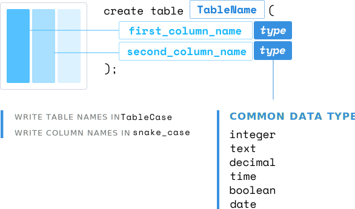

<!-- CREATE TABLE -->

<link href="style.css" rel="stylesheet"></link>

Let's create a table with SQL. Here, we're going to be using the `create` statement. We'll say `create table Users`, and then in open parentheses, we'll say `create_date`. There's going to be a `date`. `user_handle` is going to be a `uuid`. `last_name` will be a `text`. `first_name` will be a `text` as well. We'll close it off and then use a semicolon. Perfect. We've created our first table. 

```sql
$ postgres=# create table Users (
$ postgres(# create_date Date, 
$ postgres(# user_handle uuid,
$ postgres(# last_name text,
$ postgres(# first_name text );
CREATE TABLE
postgres #
```



The main principle to keep in mind here is the `create` statement. This tells your database that we'll be creating something new.

We'll use the `create` statement to add other components within our database. For this instance, we need to define what we're creating, which is a `table`. After we've established we're creating a table, we'll give it a name, `users`.

Inside the parentheses, we'll define all of the columns within our new table and list the type of data that will live within this column. For example, the `create_date` column holds date types of data. Each time data is inserted into this table, the data will need to match each data type or an error will be thrown.

`text` is referring to a string or a character type, and `uuid` is a universally unique identifier. Some other recognized types used in SQL are `boolean` and `int` for numbers. Each database such as Postgres and MySQL will have more granular and advanced types that can be used.

I will link to some popular databases that use SQL below in the video notes. I recommend taking some time to go through these because they can vary greatly between databases.

[Links]()
[to]()
[Databases]()
[Mentioned]() 