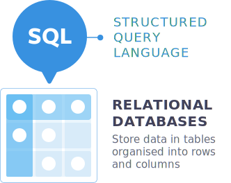
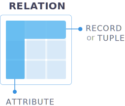
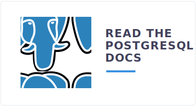
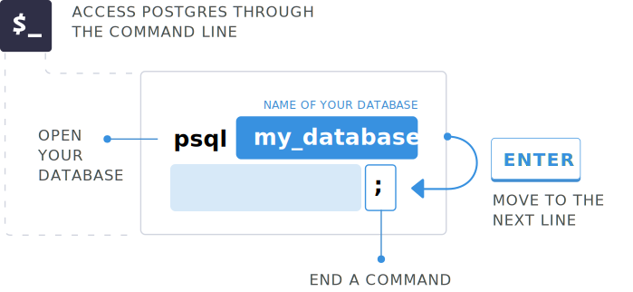

<!-- INTRODUCTION -->

<link href="style.css" rel="stylesheet"></link>

import Link from './Link.js'

SQL stands for Structured Query Language. It's a language we use to communicate with relational databases. Relational database is the idea of storing data in tables that contain rows and columns.



For example, if you think of Microsoft Excel, within Excel we have columns and we have rows. Tables are referred to as relations, columns are referred to as attributes, and each row is referred to as a record or tuple.



Some popular relational databases you've probably heard of are [Microsoft SQL Server](#), [Oracle database](), [MySQL](), and [Postgres](). These are popular choice because relational databases help developers and database admins easily categorize and store data that can be queried for exact data sets.

They're usually easy to set up and new tables can be created without needing to modify existing applications. They also provide accurate data, because it's stored only once unless designed not to.

SQL is flexible and dynamic, meaning tables and lots of data can be meshed together for one returning result and has great security practices if they are utilized. This course is designed for beginners and those who have heard of SQL but just have not had the chance to get their hands dirty with it.

Some of the takeaways I want you to have after going through this course is the ability to at least read from, write to, delete from, create and update rows, columns, and tables.

We'll be using `postgres` throughout this course as the database we'll run our SQL queries against. 




You'll find as you're working on the databases, like the ones I mentioned, don't exactly have the same types, built-in functions, errors, and other miscellaneous items. Everything that works within this course might not be 100 percent in other relational databases, but it will get you really close.

Core commands like `update`, `select`, `delete`, and `create` are pretty universal between them, there are just a few subtle differences throughout each. After watching each lesson, be sure to check out the notes of the video. I'm posting links to various DB docs on the lesson topic so that you can dive more into them. I mentioned that this course is using `postgres` for each lesson.

If you're on a Mac it can be easily installed through the package manager Homebrew. 

<Link class="fancylink" url='https://brew.sh/' urlname='Install Homebrew for Mac' />

Once it's in there, all you need to do is go to your terminal and run `brew install postgres`. 

### Terminal
```bash
$ brew install postgress
```

If you're on Windows download the interactive installer from the Postgres docs.

<Link url='https://www.postgresql.org/download/windows/' urlname='Windows Postgres installer' />

This installer is pretty straightforward and will get you up and running quickly. You'll know that everything was installed correctly when you type `psql postgres` in your terminal and you connect to your local database.

```bash
$ psql postgres
PSQL (9.6.4)
Type "help" for help 

$ postgres=#
```

